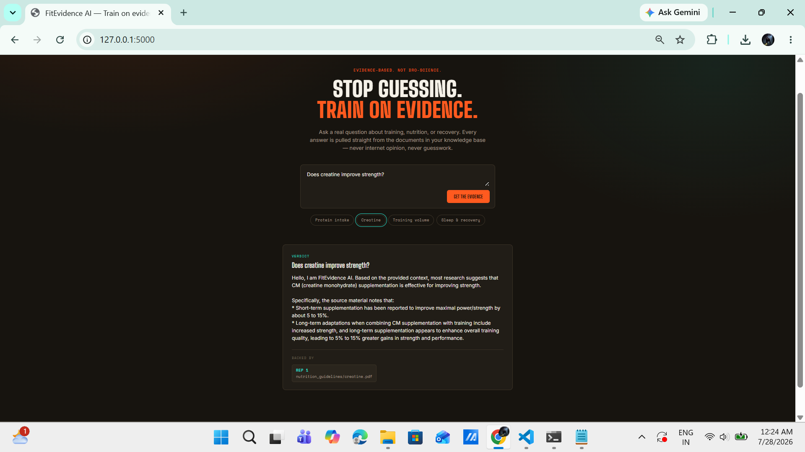
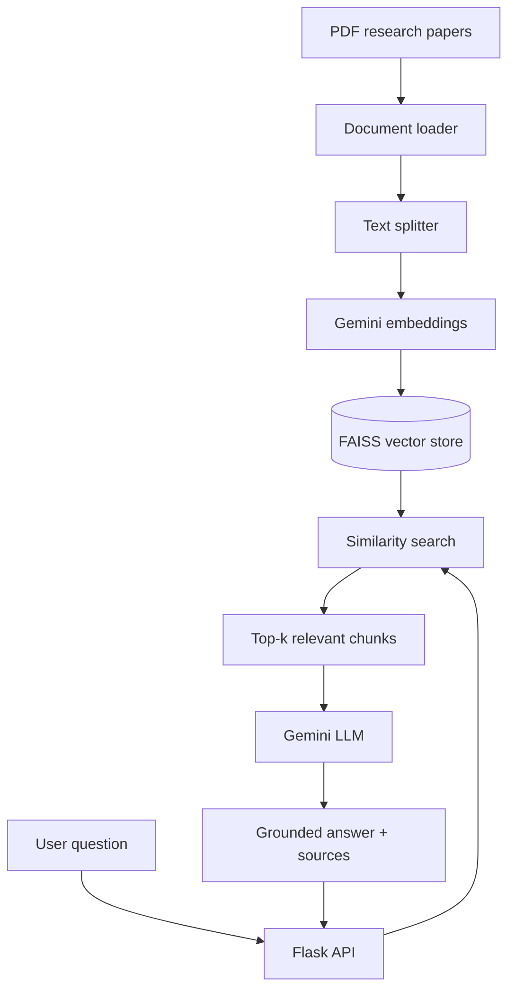

# 🏋️ FitEvidence AI

**An evidence-based fitness assistant powered by Retrieval-Augmented Generation (RAG).**

Ask a question about training, nutrition, or recovery — get an answer grounded in real peer-reviewed research and sports-science position stands, not internet opinion.



---

## Why this exists

Fitness advice online is a mess of conflicting claims — "training to failure is essential," "it's a waste of energy," "you need 2g of protein per pound," "you need way less." Most of it is opinion dressed up as fact.

FitEvidence AI takes a different approach: instead of asking a language model what it "thinks" about fitness, it retrieves the relevant passage from real source documents (ISSN position stands, peer-reviewed meta-analyses) and generates an answer grounded *only* in that retrieved evidence — with the sources shown alongside every answer.

## Features

- 🔍 **Grounded Q&A** — answers are generated only from retrieved source documents, not the model's general training data
- 📚 **Real evidence base** — ISSN position stands and peer-reviewed research on protein, creatine, training volume, and sleep
- 🧠 **Full RAG pipeline** — document loading → chunking → embeddings → FAISS vector search → grounded generation
- 🖥️ **Custom web UI** — Flask API + hand-built frontend, not just a Streamlit demo
- 📎 **Source transparency** — every answer shows exactly which document(s) it came from

## Architecture



**How a question is answered:**
1. Documents are chunked and embedded once, ahead of time (`build_index.py`)
2. At query time, the question is embedded and matched against those chunks via FAISS similarity search
3. The top-matching chunks are passed to Gemini as context, with an instruction to answer *only* from that context
4. The frontend displays the answer alongside the exact source file(s) used

## Tech stack

| Layer | Technology |
|---|---|
| LLM & embeddings | Google Gemini API (`gemini-3.5-flash-lite`, `gemini-embedding-001`) |
| Orchestration | LangChain |
| Vector store | FAISS |
| Backend | Flask (Python) |
| Frontend | Vanilla HTML / CSS / JavaScript |
| Document parsing | PyPDF |

## Live demo

*(coming soon — see Deployment section below)*

## Getting started

### 1. Get a free Gemini API key

Go to https://aistudio.google.com/app/apikey, sign in with a Google account, and click **Create API key**.

### 2. Clone and set up

```bash
git clone https://github.com/YOUR_USERNAME/FitEvidence-AI.git
cd FitEvidence-AI

python -m venv venv
source venv/bin/activate      # Windows: venv\Scripts\activate

pip install -r requirements.txt
```

### 3. Add your API key

```bash
cp .env.example .env
```
Open `.env` and paste your key:
```
GOOGLE_API_KEY=your_actual_key_here
```

### 4. Build the vector index

```bash
python src/build_index.py
```

### 5. Run it

```bash
python web/server.py
```

Open **http://localhost:5000** and ask a question.

## Adding your own documents

Drop `.pdf` or `.txt` files into any of:
- `data/research_papers/`
- `data/nutrition_guidelines/`
- `data/fitness_articles/`

Then rebuild the index: `python src/build_index.py`

## Project structure

```
FitEvidence-AI/
├── data/                      # source documents (PDFs)
├── embeddings/vector_store/   # generated FAISS index
├── src/
│   ├── document_loader.py     # loads PDFs/TXT from data/
│   ├── text_splitter.py       # chunks documents
│   ├── embedding.py           # Gemini embedding wrapper
│   ├── build_index.py         # ingestion pipeline (run once)
│   ├── retriever.py           # similarity search over FAISS
│   └── llm.py                 # generates grounded answers via Gemini
├── web/
│   ├── server.py               # Flask backend + API
│   ├── templates/index.html    # website markup
│   └── static/                 # style.css, script.js
├── streamlit_app.py            # legacy Streamlit UI (optional)
├── requirements.txt
└── .env.example
```

## Troubleshooting

- **"No vector store found"** → run `python src/build_index.py` first.
- **"GOOGLE_API_KEY not found"** → make sure `.env` exists and contains your real key.
- **429 / RESOURCE_EXHAUSTED errors** → you've hit Gemini's free-tier daily quota; wait for it to reset or check https://ai.google.dev/gemini-api/docs/rate-limits.
- **Model not found errors** → Gemini model names change over time; check https://ai.google.dev/gemini-api/docs/models for current names.

## Roadmap

- [ ] Deploy a public live demo
- [ ] Inline citations within the answer text itself (not just a source list)
- [ ] Conversation memory for follow-up questions
- [ ] Document upload directly from the UI
- [ ] Evaluation suite comparing grounded vs. non-grounded answers

## License

MIT
